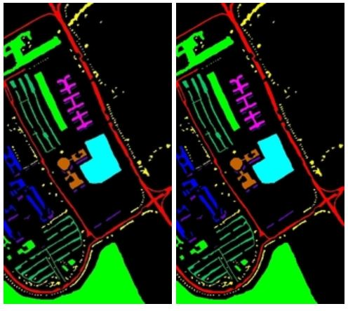
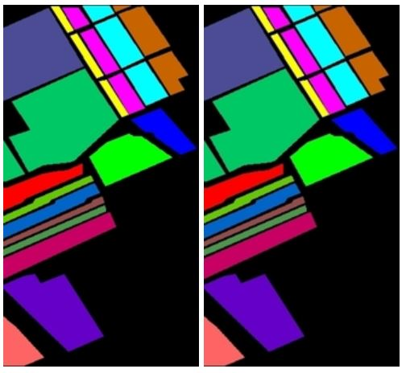
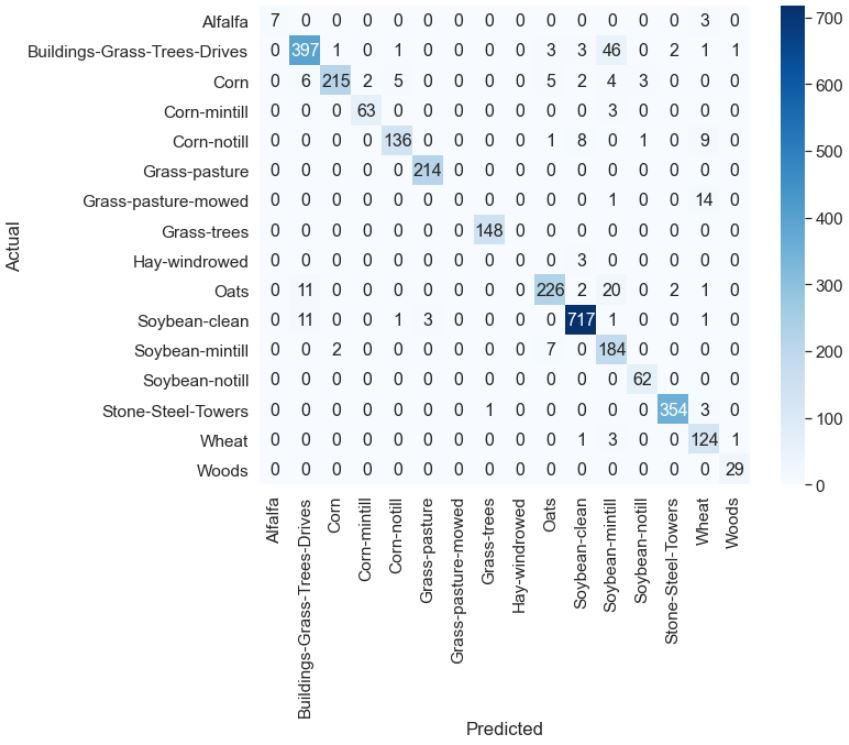
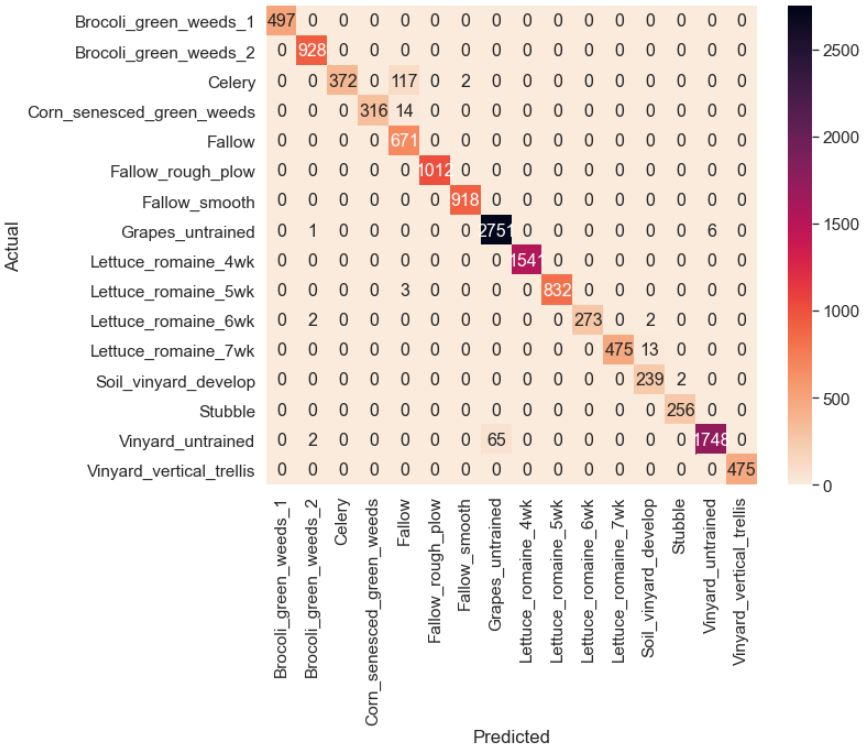

# MDA-HSI - Multi-Dimensional Deep Hierarchical Approach Towards Aerial Hyperspectral Image Classification

## Description 

This paper proposes MDA-HSI, a dual model integrated voting network for hyperspectral image classification. The first model employs a 3D-2D hierarchical structure to provide the spectral spatial joint features along with the abstract level spatial representation of 2D CNNs. The second model is a 3D CNN where the performance increase is provided by incorporating overlapping patches on the original hyperspectral cube to create feature maps over multiple contiguous bands.

## Datasets

This system has employed models, which use the three publicly available and highly popular hyperspectral imaging datasets - Indian pines (landscape in Indiana, a state in the United States, with agricultural and natural vegetation dominating the landcover distribution) , Salinas Valley(The scenery at this location is one of less agriculture and mere plants and bushes, vineyards and barren land) , University of Pavia ( was collected by the ROSIS sensor, in flight over the Pavia university and Pavia Centre, Italy).

Salinas data is of size 512×217×224 with a 3.7 meter spatial resolution with 512 × 217 is spatial and 224 spectral dimensions. It comprises of vineyard fields, vegetables and bare soils and has 16 categories .Indian Pines data in the wavelength range 0.4 − 2.5 × 10−6 is of size 145×145×224 meters where 224 spectral dimensions and 145 × 145 spatial dimensions are available. Indian Pines provides 16 non mutually exclusive classes. Pavia University Data consists of 103 spectral bands and 610 × 610 spatial dimensions with a 1.3 meter spatial resolution. 

## Prerequisites

- [Tensorflow](https://github.com/tensorflow/tensorflow)
- [Keras 2.0](https://github.com/fchollet/keras)
- [Spectral](https://github.com/spectralpython/spectral)
- [OpenCV-Python](https://github.com/opencv/opencv)

## Model Architecture

A hierarchical approach of 3D-2D is followed for the classification process. 2D CNNs use two dimensional kernels for input data convolutions. The full spatial dimension is covered by the kernel striding over. Gradient descent optimization is employed for parameter training of the CNN architecture (kernel weight and bias). The application of convolutions on the spatial layer alone is characteristic to HIS 2D CNNs and this property is utilized with a front 3D CNN architecture to arrive at a more abstract level representation of reduced dimensionality, which in turn reduces the high complexities involved with the spectral spatial joint representations provided by 3D CNNs. T

## Results

### Indian Pines Dataset
 

### Pavia University Dataset
 

### Salinas Dataset

## Metrics

  

  

  

## Conclusion

This paper introduces MDA-HIS, a dual multidimensional deep network finetuned for the task of hyperspectral image classification. The main goal of the proposed model is to consider both the spectral and spatial joint representations and interdependencies during the classification process while keeping the computational complexities minimal. We achieve this through two unique approaches. The first approach follows a hierarchical 3D 2D flow where the spectral spatial features are accounted for while an abstract level spatial 2D CNN completes the hierarchy reducing dimensionality. The second approach employs a modified 3D CNN that produces overlapping 3D feature patches over several contiguous bands processed under a three dimensional kernel function to obtain spectral inferences. The overall prediction is made as an weighted ensemble of the two models, which provides a well
defined approach taking all inherent information into consideration for the classification process. The MDA-HSI was tested upon benchmark datasets with existent deep methods which are currently in practice. The MDA-HIS proved efficient both in terms of average accuracy and Kappa score upon evaluation. Future work in this direction can look into the possibilities of self learning ensembles and improving classification strength through data augmentation.
